# Dự án Hệ thống Theo dõi Xu hướng Xuất bản Bài báo Khoa học (Trend-Tracking)

**Code name:** `Trend-Tracking`

## I. Tổng quan dự án

### Mục tiêu

Mục tiêu của dự án này là xây dựng một hệ thống phần mềm (Web Application) để thu thập, phân tích và theo dõi xu hướng xuất bản của các bài báo khoa học. Hệ thống cung cấp cho các nhà nghiên cứu, sinh viên và chuyên gia một công cụ trực quan để tìm kiếm bài báo, theo dõi sự phát triển của các lĩnh vực nghiên cứu thông qua phân tích từ khóa, tác giả, tạp chí và trích xuất các báo cáo thống kê chuyên sâu.

### Phạm vi

Phạm vi dự án bao gồm các chức năng chính:
- Thu thập dữ liệu tự động (Scraping) từ các nguồn API bài báo khoa học mở (như arXiv).
- Tìm kiếm, lọc và tra cứu thông tin chi tiết bài báo, tác giả, tạp chí, từ khóa.
- Phân tích và trực quan hóa dữ liệu xu hướng xuất bản bằng biểu đồ.
- Quản lý định danh (đăng ký, đăng nhập, phân quyền người dùng).
- Chức năng lưu trữ bài báo yêu thích (Bookmark) và tạo báo cáo cá nhân (Report) dành cho người dùng.
- Quản trị hệ thống, quản lý người dùng và thay đổi cấu hình động dành cho Admin.

### Giả định và ràng buộc

- Hệ thống phân tích và tra cứu dựa trên metadata của bài báo (tiêu đề, tóm tắt, năm xuất bản, DOI, trích dẫn, từ khóa), không lưu trữ hoặc xử lý toàn văn (full-text PDF) nhằm tối ưu hiệu năng.
- Quá trình thu thập dữ liệu (Scraping) cần có kết nối Internet liên tục để gọi API.
- Ứng dụng chạy trên kiến trúc 3-tier: Frontend (React), Backend (Express REST API) và Database (PostgreSQL).

## II. Yêu cầu chức năng

### Các tác nhân

Hệ thống Trend-Tracking bao gồm 3 tác nhân (Actor) chính: Guest (Khách), User (Người dùng đăng nhập bao gồm Researcher/Student), và Admin (Quản trị viên).

Code PlantUML

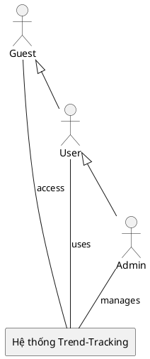

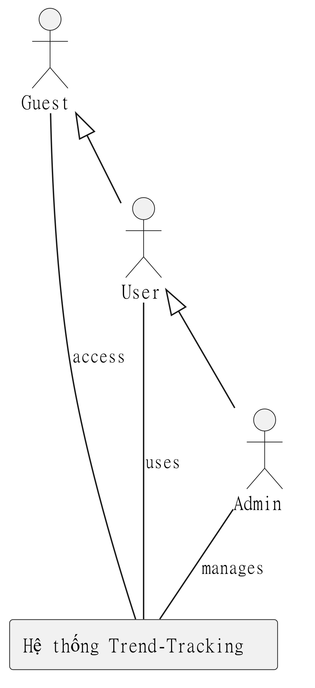

### Các chức năng chính

**Guest (Khách truy cập):**

* **Tìm kiếm bài báo:** Tìm kiếm dữ liệu theo tiêu đề, tác giả, từ khóa, DOI, hoặc năm xuất bản.
* **Xem chi tiết bài báo:** Xem tóm tắt (abstract), năm, lượt trích dẫn, nguồn (provider), và link gốc.
* **Xem xu hướng (Trends):** Xem các biểu đồ trực quan về sự phát triển của bài báo khoa học theo thời gian, theo chuyên ngành hoặc từ khóa thịnh hành.
* **Đăng nhập:** Truy cập vào tài khoản đã đăng ký.
* **Đăng ký:** Tạo tài khoản mới trong hệ thống.

**User (Researcher / Student):**

* **Quản lý Bookmark:** Lưu lại (bookmark) các bài báo quan tâm để đọc sau, xem danh sách đã lưu, xóa bookmark.
* **Quản lý Báo cáo (Report):** Tạo các báo cáo thống kê, phân tích cá nhân. Xem, sửa, và xóa báo cáo đã tạo.
* **Quản lý thông tin tài khoản:** Cập nhật thông tin hiển thị cá nhân (Họ tên) và thay đổi mật khẩu.

**Admin:**

* **Quản lý người dùng:** Xem danh sách toàn bộ người dùng, phân quyền (Role: RESEARCHER, STUDENT, ADMIN), khóa hoặc xóa tài khoản.
* **Quản lý dữ liệu nền tảng:** Xem danh sách, cập nhật các bài báo, tạp chí (Journal), tác giả (Author), từ khóa (Keyword) trong hệ thống.
* **Quản lý thu thập dữ liệu:** Chủ động kích hoạt tác vụ cào dữ liệu (Scraping) từ API bên ngoài.
* **Quản lý cấu hình hệ thống:** Chỉnh sửa, cập nhật các thiết lập cấu hình chung (SystemSetting).

### Biểu đồ Use Case

Code PlantUML

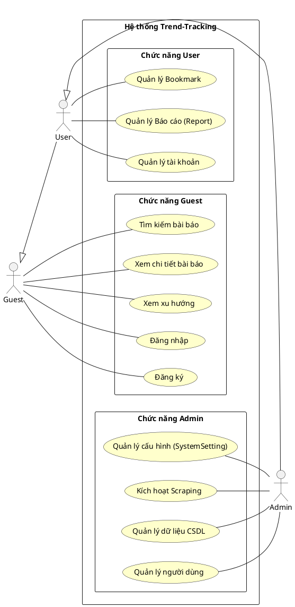

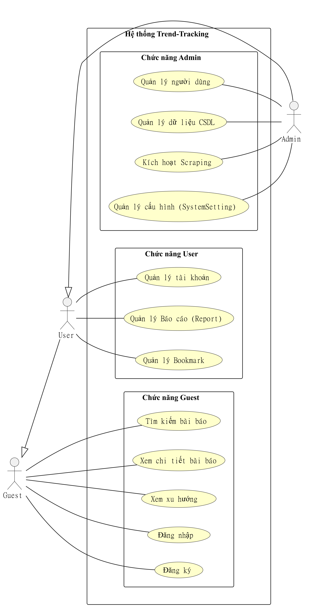

### Biểu đồ Use Case chi tiết

#### Chức năng Guest

Code PlantUML

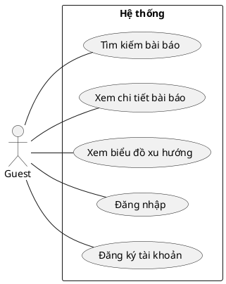

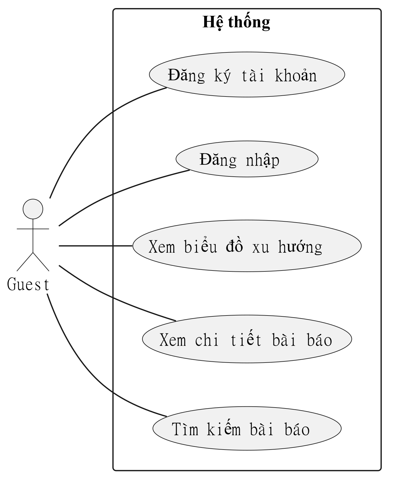

#### Chức năng User

Code PlantUML

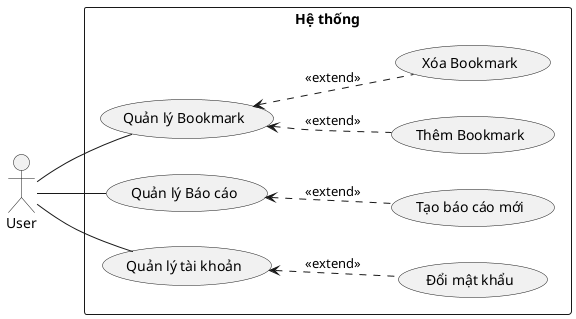

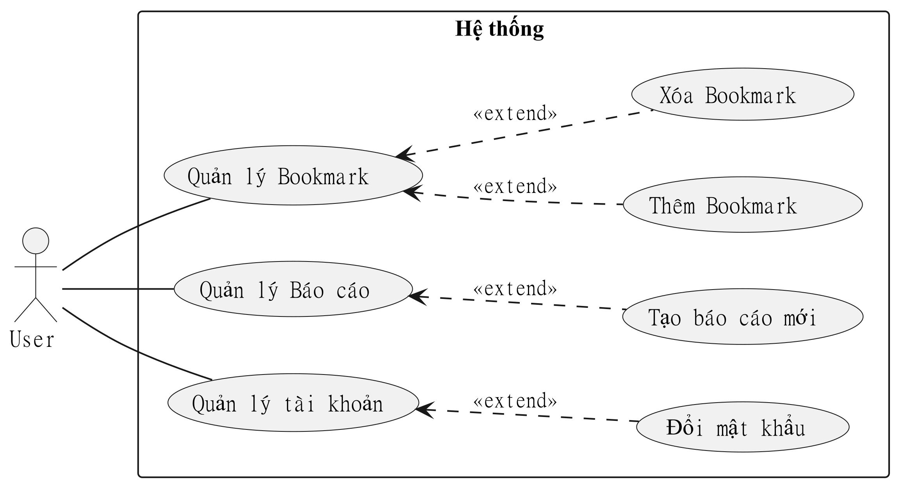

#### Chức năng Admin

Code PlantUML

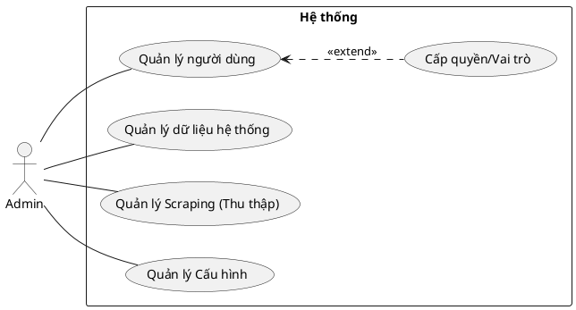

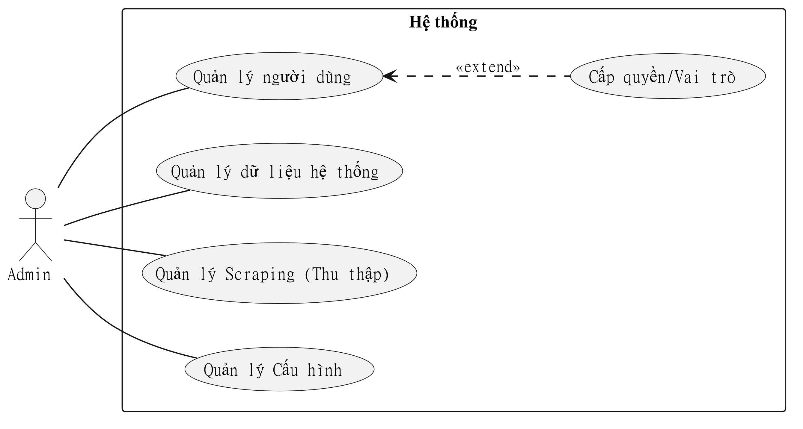

### Quy trình hoạt động

#### Quy trình thu thập dữ liệu (Scraping)

Code PlantUML

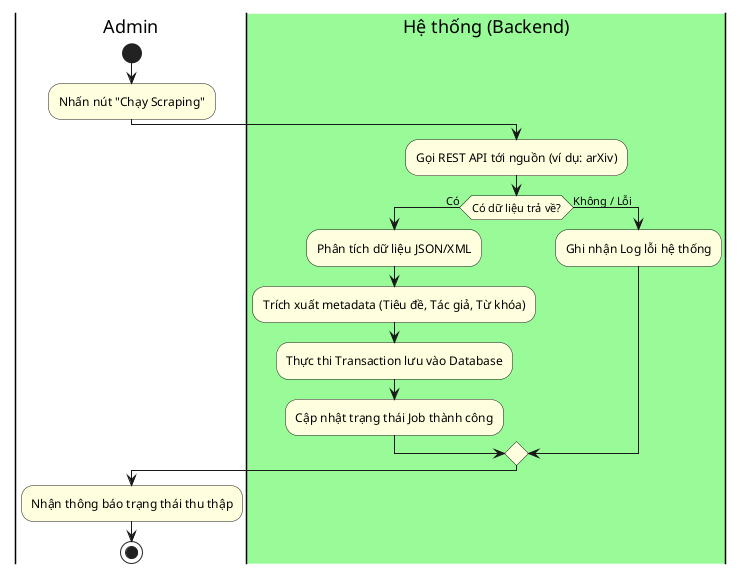

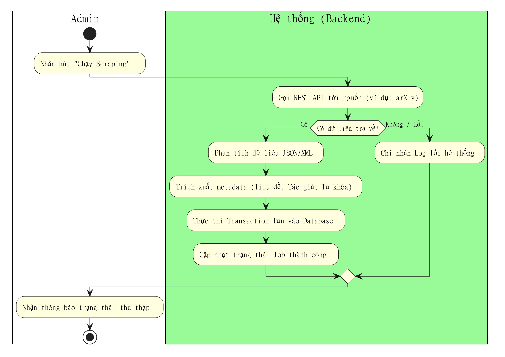

### Luồng xử lý

#### Luồng xử lý tạo Báo cáo (Report)

Code PlantUML

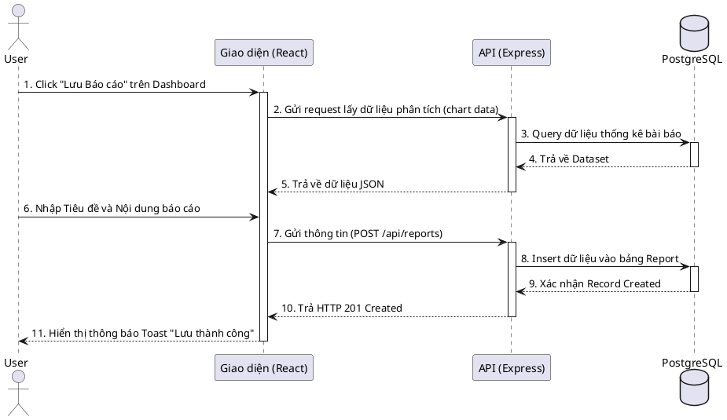

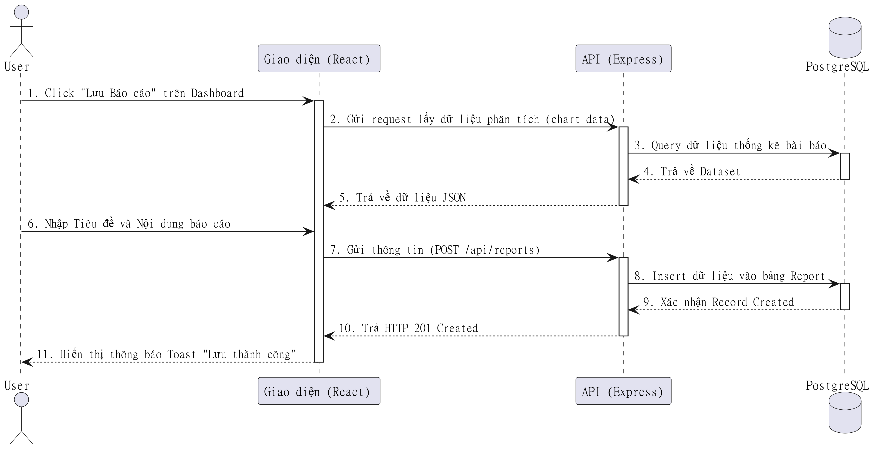

### Luồng dữ liệu

Code PlantUML

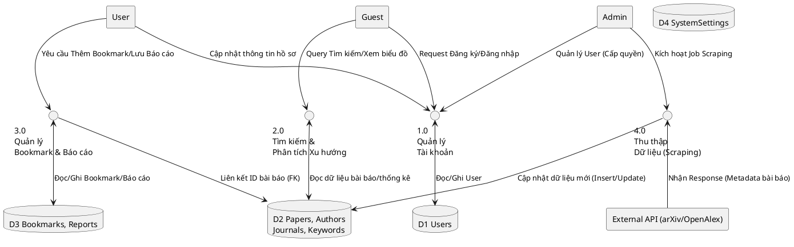

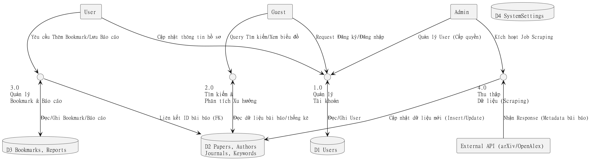

### 3.3. Các trạng thái thực thể trong hệ thống

Phần này mô tả các vòng đời và sự chuyển đổi trạng thái (State Machine Diagram) của các thực thể quan trọng trong hệ thống.

#### 1. Trạng thái Tài khoản Người dùng (User Account)

Code PlantUML

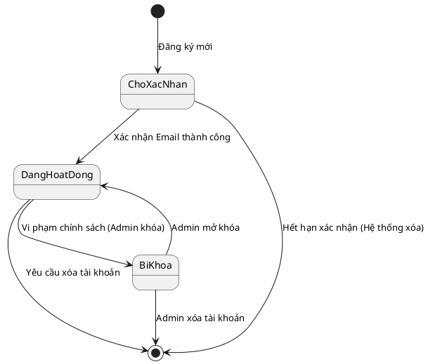

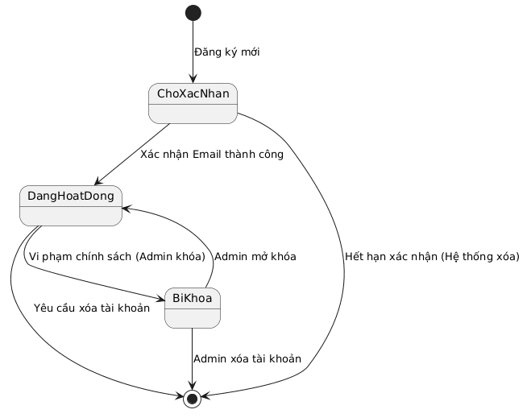

#### 2. Trạng thái Tiến trình Thu thập dữ liệu (Scraping Job)

Code PlantUML

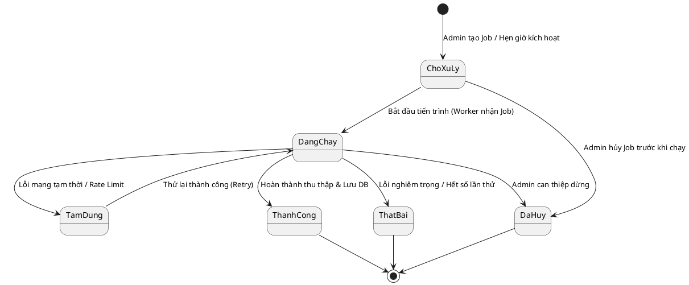

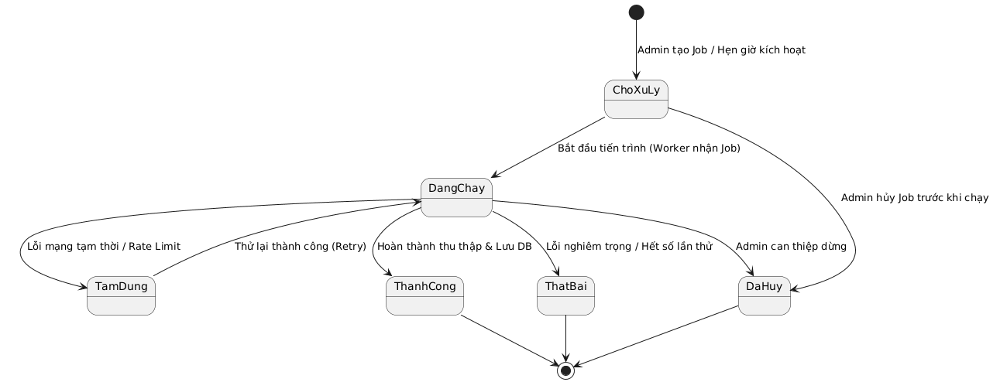
